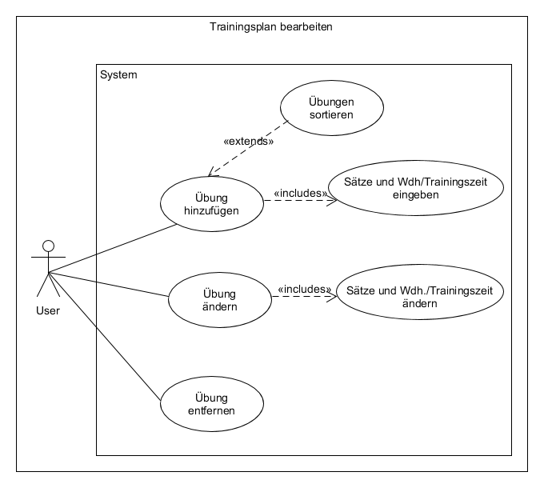

# Anforderungs- und Entwurfsspezifikation ("Pflichtenheft")

## Xtreme Xercising - Mobile Anwendung zur Erstellung, Ausführung und Auswertung von Trainingsplänen
#### Autoren: Pascal Squarra, Jacqueline Menke, 

**Inhaltsverzeichnis**
======================

1. Einführung
    1.1 Beschreibung
    1.2 Ziele
2. Anforderungen
    2.1 Funktionale Anforderungen
    2.2 Nicht-funktionale Anforderungen
        2.2.1 Rahmenbedingungen
        2.2.2 Betriebsbedingungen
        2.2.3 Qualitätsmerkmale
    2.3 Grafische Benutzerschnittstelle
    2.4 Anforderungen im Detail
3. Technische Beschreibung
    3.1 Systemübersicht
    3.2 Softwarearchitektur
    3.3 Datenmodell
    3.4 Abläufe
    3.5 Entwurf
 4. Projektorganisation
    4.1 Annahmen
    4.2 Verantwortlichkeiten
    4.3 Grober Projektplan
 5. Anhänge
    5.1 Glossar
    5.2 Referenzen
    5.3 Index

# 1 Einführung

## 1.1 Beschreibung
Die App "Xtreme Xercising" soll sowohl vorgefertigte Trainingspläne enthalten, wie auch dem Benutzer die Möglichkeit bieten, eigene Trainingspläne zu erstellen. Dabei kann man aus einer Vielzahl an Übungen auswählen oder eigene hinzufügen. Die Übungen können zur besseren Übersicht nach Name, Muskelgruppe oder Kategorie sortiert werden. Fügt man Übungen zu einem Trainingsplan hinzu, legt man zuvor noch die Anzahl an Wiederholungen und Sätzen oder die Dauer der Ausführung fest. Im Trainingsmodus können die Übungen dann in beliebiger Reihenfolge ausgeübt werden und das geschaffte Gewicht bzw. die zurückgelegte Strecke eingetragen werden. Im Statistikmodus kann der Trainingserfolg mithilfe eines Graphen angezeigt werden, wobei die jeweilige Übung und der Zeitraum eingestellt werden können. Auch die Verteilung der trainierten Muskelgruppen und weitere Statistiken sollen hier einsehbar sein. Darüber hinaus kann der Benutzer einen Alarm einstellen, der ihn in Form einer Push-Benachrichtigung ans Training erinnert.

## 1.2 Ziele
    
#### Anwendungsbereiche
Zu den größten wachsenden Trends der letzten Jahre kann man sowohl die Digitalisierung wie auch das Thema Gesundheit und alle damit verbundenen Unterthemen wie Fitness, gesundem Lifestyle und Ernährung zählen.[1] Diese Trends sind offensichtliche Begleiterscheinungen der allgemeinen weltweiten Entwicklung: Der technologische Fortschritt erschließt immer neue Märkte, das alltägliche Leben wird zunehmend digitalisiert und das Smartphone ist der ständige Begleiter. Über das bloße Telefonieren und Schreiben von Mitteilungen ist das Handy längst hinausgewachsen. Heutzutage nutzt man es zur Informationsgewinnung, zum Einkaufen, zum Planen und Strukturieren des Tagesablaufes, zu Unterhaltungszwecken und vielem mehr. Gleichzeitig wächst der Gesundheitsbegriff immer weiter. Hierbei geht es nicht mehr nur um die bloße körperliche Gesundheit, sondern vielmehr um die “aktive Selbstoptimierung“[1] mit dem “neue[n, Anm. d. Verf.] Ziel einer Gesamtgesundheit“[1]. Gesunde Ernährung und regelmäßiger Sport gewinnen immer stärker an Bedeutung. Dahingehend wird auch die Kombination dieser beiden Trends in Form von Fitness- und Health-Apps immer bedeutsamer.[1]
Bereits 15.000 mobile Anwendungen dieser Art werden in Deutschland angeboten, weltweit sind es bereits 40.000. Zwischen 2011 und 2012 ist die Anzahl der Downloads beinahe auf das Doppelte angewachsen: von 124 Millionen auf 247 Millionen. Die Idee hinter diesen Applikationen ist einfach: das Handy als handlichen und immer greifbaren Begleiter soll die Menschen bei ihren Zielen, zum Beispiel Abnehmen, Muskelaufbau oder Fitnesssteigerung, auf motivierende, einfache und spielerische Weise unterstützen.[1] Auf diese Anwendung ist auch Xtreme Xercising ausgelegt.

#### Motivation
Da der Markt im Bereich mobiler Anwendungen zum Thema Fitness, Gesundheit und Lifestyle immer stärker wächst, fällt es auch dementsprechend schwer, die für einen persönlich am besten geeignete Anwendung zu finden. Aus diesem Grund haben wir uns das Ziel der Entwicklung einer FitnessApp gesetzt. Ein ansprechendes und einprägsames Design in Kombination mit intuitiver und einfacher Bedienung verbindet die - unserer Meinung nach - wichtigsten Grundfunktionen für die Trainingsplangestaltung, -verwaltung, -ausführung und Fortschrittüberwachung. Xtreme Xercising soll somit der digitale Freund und Begleiter beim Sport werden. Durch das einfache Prüfen des Trainingserfolgs in Form von anschaulichen Graphen sowie das Erinnern durch Benachrichtigungen ans Trainieren soll die Motivation gefördert werden. Die Bedienung ist simpel und selbsterklärend, sodass das Eintragen der Trainingsdaten das Training erleichtern und verbessern soll. 

#### Umfang
Mit der Anwendung soll der Nutzer eigene Trainingspläne erstellen und vorhandene ändern oder löschen können. Bei der Erstellung wird ein Name angegeben, eine Kategorie (Muskelaufbau, Cardio, Definition) ausgewählt und bei Bedarf eine Erinnerung festgelegt. Dabei können Wochentag und Uhrzeit festgelegt werden, sodass sich der Benutzer zum festgelegten Zeitpunkt an sein Training erinnert lassen kann. 
Zu einem Trainingsplan können dann Übungen hinzugefügt und wieder entfernt oder Änderungen an diesen vorgenommen werden. Dabei legt man die Sätze und Wiederholungen beziehungsweise die Trainingszeit fest. Außerdem gibt es die Möglichkeit, neben den bereits vorhandenen Übungen eigene zu erstellen, diese zu löschen oder zu verändern. Zum Erstellen vergibt man wie bei den Trainingsplänen einen Namen, wählt aus einer Kategorie (Ausdauer, Freie Übung, Maschine) aus und gibt die beanspruchten Muskelgruppen (Bauch, Bizeps, Brust, Oberschenkel, Po, Rücken, Schultern, Trizeps, Waden) an.

Im Trainingsmodus können die Übungen eines Trainingssplans in beliebiger Reihenfolge abgearbeitet werden, wobei ein Progress-Bar den Nutzer über den Fortschritt des Trainings informiert. Nach der Ausführung der Training können immer jeweils pro Satz das geschaffte Gewicht oder die zurückgelegte Strecke notiert werden. Das Beenden eines Trainings wird dem Nutzer in Form eines Erfolgsbildschirms mitgeteilt.

In der Statistik kann der Nutzer aus vielen unterschiedlichen grafischen Darstellungen und Tabellen einen Überblick über seine sportlichen Leistungen gewinnen. Der erste Graph stellt die Maximalleistung einer Übung in einem festlegbaren Zeitraum dar. Ein weiterer Graph basiert auf einem kummulierten Wert aus Sätzen, Wiederholungen und Gewicht bzw. aus Zeit und Strecke. Auch hier wählt der Nutzer den zu berücksichtigten Zeitpunkt aus. Darüberhinaus gibt eine Pie Chart mit der Verteilung der trainierten Muskelgruppen und weitere allgemeine Statistiken (z.B. die Gesamtanzahl der absolvierten Trainings, der ausgeführten Übungen, der besten Ergebnisse, u.ä.). Außerdem soll es die Möglichkeit geben, die Körperdaten des Users zu erfassen und aktualisieren zu können, um eine Übersicht über die Veränderungen von Gewicht, Body Mass Index und der Körpermaßen bereit zu stellen.

#### Marktanforderungen
Aufgrund der - wie bereits erwähnten - riesigen und zudem weiterhin stark wachsenden Anzahl an Fitness-Apps, ist es generell kein einfaches Unterfangen, mit einer solchen Anwendung aus der Masse herauszustechen. Aus diesem Grund wird bei der Entwicklung der App auf folgende Aspekte besonderen Wert gelegt: Design, Usability und Funktionalität.

Der Aspekt, den der Nutzer als ersten vor allen anderen wahrnimmt und als primäres Kriterium für den Download gilt, ist das Design. Bevor die App ausprobiert und getestet wird, entscheidet allein der äußerliche Eindruck, ob die Anwendung gefällt oder nicht. Dementsprechend haben wir uns für ein Design entschieden, das mit kräftigen Farben und klaren Formen überzeugt, welches optisch ansprechend und interessant ist, ohne vom Inhalt abzulenken und gleichzeitig einen hohen Wiedererkennungswert hat. 

Der zweite wichtige Aspekt ist die Usability, also die Bedienungsfreundlichkeit der Anwendung. Hat der Nutzer sich dafür entschieden, eine Anwendung herunterzuladen, wird er sie zunächst oberflächlich ausprobieren. Dabei entscheidend ist, dass der Nutzer die Bedienung intuitiv erfassen kann, weil sie ihm vertraut vorkommt. Zu diesem Zweck sind alle Buttons selbsterklärend oder durch anschauliche Icons dargestellt, die ihre FUnktionalität eindeutig ausweisen. Wichtig ist hierbei auch der Aspekt der Kontinuität, also dass Buttons mit gleicher Funktion in unterschiedlichen Kontexten gleich aussehen, was die Bedienung ebenfalls erleichtert. Darüberhinaus verzichtig die App weitgehend auf Textlabels und benutzt diese nur, wenn es nicht anders geht. Das liegt zum einen an der begrenzten Bildschirmfläche mobiler Geräte und der Tatsache, dass viel Text eine Anwendung unnötig komplziert wirken lässt. Desweiteren muss die logische Verknüpfung der einzelnen Bildschirme, also die GUI-Navigation, logisch nachvollziehbar und einfach sein, damit der Nutzer immer weiß, wo er sich gerade befindet und wie er zu seinen gewünschten Aktionen kommt.

Der letzte Aspekt ist die Funktionalität, die der Nutzer erst dann im vollen Umfang testen wird, nachdem er die Bedienung als einfach und selbsterklärend eingestuft hat. Zu diesem Zweck bietet die App die Möglichkeit, nicht nur Trainingspläne individuell zu erstellen, sondern neben der Vielzahl an bereits vorhandenen Übungen eigene erstellen zu können. Gleichzeitig kann der Nutzer seinen Trainingserfolg durch unterschiedliche Graphen und Statistiken prüfen. 

#### Alleinstellungsmerkmale
Was die Applikation Xtreme Xercising so besonders macht, ist das einzigartige und unverkennbare Design, der hohe Grad an Funktionalität und die einfache und intuitive Bedienung der Anwendung. Oftmals leiden mobile Applikation, die sehr viele und komplexe Funktionen anbieten, unter einem nüchternen Design und einer mangelnden Usability. Genau aus dem Grund ist das Hauptmerkmal von Xtreme Xercising, bei vollem Funktionsumfang und vielfältigen Nutzungsmöglichkeiten den User nicht zu überfordern, sondern ihn durch übersichtliches Design, leichte Bedien- und Verständlichkeit und ohne viele Erklärungen zum Ziel zu führen. Somit sind der designtechnische und der Usability-Aspekt ein wichtiger Leitfaden, der sich durch den gesamten Entwicklungsprozess fortführt und immer wieder erneut getestet und verbessert wird. Um dies zu gewährleisten, sind auch Nutzertests vorgesehen, die die Nutzerfreundlichkeit überprüfen und neue Eindrücke liefern sollen.

#### Zielbenutzergruppe
Zur Zielgruppe zählen alle Sport-, Fitness-, und Gesundheits-Interessenten jeglicher Altersgruppen (mit besonderem Augenmerk auf die unter 20-Jährigen bis 40-Jährigen). Die App richtet sich sowohl an Menschen, die ihr Training zu Hause, als auch im Fitness Studio absolvieren möchten. Egal ob Gewichtsverlust, Muskelaufbau oder Cardio-Training: die Applikation ist für jegliche sportliche Zielrichtung ausgelegt. Anfänger können mit der Anwendung ihren Einstieg ins regelmäßige und erfolgreiche Trainin gunterstützen und erste Fitnesserfahrungen sammeln. Fortgeschrittene haben die Möglichkeit, ihre Trainingserfolge besser prüfen und einschätzen zu können. Da die Anwendung leicht zu bedienen ist und wenig technisches Verständnis erfordert, ist sie für eine breite Nutzergruppe geeignet. Das Design ist modern und schlicht gehalten und eignet sich sowohl für weibliche als auch männliche Nutzer.

#### Abgrenzung

Die Fitness Applikation dient nicht dem Zweck der Erläuterung und richtigen Ausführung von sportlichen Übungen. Das bedeutet, dass es keine entsprechenden Anleitungen oder Bilder zur korrekten Ausführung geben wird. Auch eine Community- oder eine Share-Funktion, mit Hilfe derer sich Nutzer austauschen oder gegenseitig untersützen können, ist zu diesem Zeitpunkt nicht eingeplant. Des weiteren werden auch jegliche medizinischen, gesundheitlichen und ernährungsspezifischen Aspekte nicht in der Fitness-App berücksichtigt.

# 2 Anforderungen

## 2.1 Funktionale Anforderungen  
#### Use-Case-Diagramm "Trainingsplan"
     
    
   
Use-Case-Diagramm zu den Funktionen des Trainingsplans. Dieser kann durch den Nutzer erstellt, editiert oder gelöscht werden. Bei der Erstellung eines neuen Trainingsplans muss generell nur ein Name eingegeben werden, optional kann eine Benachrichtigung erstellt werden, die den Nutzer an die Ausübung des Plans erinnert. Soll der Trainingsplan verändert werden, können Name und Benachrichtigung nach Belieben angepasst werden.

#### Use-Case-Diagramm "Trainingsplan bearbeiten"  
     
    
   
Hat man einen Trainingsplan erstellt, so können diesem neue Übungen als Übungseinheit hinzugefügt, verändert oder wieder entfernt werden. Um nach einer bestimmten Übung zu suchen, lassen sich diese nach verschiedenen Kriteriern sortieren. Hat man sich für eine Übung entschieden, muss der Nutzer die Anzahl an Sätzen und Wiederholungen angeben oder die Dauer die Ausführung. Selbiges kann beim Editieren einer Übung verändert werden.
   
#### Use-Case-Diagramm "Eigene Übungen erstellen"  
     
    
   
#### Use-Case-Diagramm "Trainieren"  
     
    
   
#### Use-Case-Diagramm "Statistik auswerten"  
     
    

## 2.2 Nicht-funktionale Anforderungen 

### 2.2.1 Rahmenbedingungen
    - Normen, Standards, Protokolle, Hardware, externe Vorgaben

| **Kategorie**| **Anforderung**|
|:-----|:----------:|
| Normen | ... |
| Standards | ... |
| Protokolle | ... |
| Hardware | Endgeräte: Google Nexus 5X API-Level ?????????, Samsung Galaxy S7 API-Level ????????? |
| Externe Vorgaben | ... |

### 2.2.2 Betriebsbedingungen
    - Vorgaben des Kunden (z.B. Web Browser / Betriebssystem Versionen, Programmiersprache)
    
| **Kategorie**| **Anforderung**|
|:-----|:----------:|
| Entwicklungsumgebung | Visual Studio Code |
| Programmiersprache | Javascript (React Native) |
| Compile-SDK-Version | ... |
| Dokumentation | Markdown |
| Versionsverwaltungssoftare | Git mithilfe von GitHub und GitHub Desktop |
| UML-Werkzeug | UMLet Version 14.2 |
| Mockup Tool | Balsamiq Mockups 3 Version 3.5.15 |

### 2.2.3 Qualitätsmerkmale
    - Externe Qualitätsanforderungen (z.B. Performance, Sicherheit, Zuverlässigkeit, Benutzerfreundlichkeit)
    
| **Kategorie**| **Merkmal**|
|:-----|:----------:|
| Performance | ... |
| Sicherheit | Datenspeicherung bei jeder Datenmanipulation mithilfe der dokumentenbasierten Datenbank Couch.db bzw. Pouch.db |
| Zuverlässigkeit | ... |
| Benutzerfreundlichkeit | ... |

## 2.3 Graphische Benutzerschnittstelle
#### Ladebildschirm  
     
    
   Im Ladebildschirm sieht man sowohl den Schriftzug als auch einen Loading-Spinner, der den Warteprozess verbildlicht, während im Hintergrund die Datenbank arbeitet und Daten daraus extrahiert werden. Darunter sieht man den Slogan der Applikation: Be the best version of yourself. Dieser soll dazu motiveren, jeden Tag sein bestes zu geben und sich zu verbessern, um seine Ziele zu erreichen, ohne sich mit anderen vergleichen zu müssen. Zugleich erkennt man die hauptsächliche Farbgestaltung, die primär aus einem dunklen Graubraun und zusätzlich aus einem feurigen Rot-Orange als Akzentfarbe besteht. Diese wird stringent durch das gesamte Design fortgeführt und eingehalten.
   
#### Trainingspläne  
     
    
   Das folgende Mockup zeigt den Hauptbildschirm der Anwendung. Oben links sieht man den Toggle-Button für den Navigation Drawer, mit dem sich dieser öffnen lässt. Die Statistik findet sich im Navigation Drawer, den man problemlos aus vielen verschiedenen Bildschirmen heraus erreichen kann. Darunter sieht der Nutzer alle selbst erstellten Trainingspläne in einer Liste. Unter dem Namen des Plans findet sich zudem die jeweilige Kategorie und rechts erscheinen, falls vom Nutzer so eingestellt, zwei Images: eine Glocke, falls für den Trainingsplan eine Benachrichtigung eingestellt wurde, und ein Stern, falls der Plan zu den Favoriten hinzugefügt wurde. Damit lassen sich beim Scrollen die bevorzugten Trainingspläne rasch wiedererkennen. Der FloatingActionButton mit dem Plus ermöglicht es, wie das Image bereits vermuten lässt, neue Trainingspläne zu erstellen.
   
#### Trainingsplan erstellen  
     
    
   Hier sieht man ein kleines Dialogfenster, in dem schnell und unkompliziert ein neuer Trainingsplan angelegt werden kann. Theoretisch ist es ausreichend einen Namen anzugeben, eine Kategorie auszuwählen und mit 'Ok' zu bestätigen. Außerdem kann über das bereits bekannte Glockensymbol ein weiterer Dialog geöffnet werden, mit dem eine Benachrichtigung erstellt werden kann. Dieser enthält einen TimePicker für die Uhrzeit und eine Drop-DownListe für den Wochentag, an welchem man trainieren möchte.
   
#### Menü  
     
    
   In diesem Bildschirm sieht man den Navigation-Drawer, der aus vielen verschiedenen Bildschirmen (siehe Zustandsdiagramm für die GUI-Navigation) heraus erreichbar ist. In diesem Menü kann man alle wichtigen Seiten der Applikation erreichen und persönliche Einstellungen vornehmen.
   
#### Trainingsplan  
     
    
   Dieser Bildschirm ist als eine Art Navigation-Screen zu verstehen: von hier aus hat man die Möglichkeit, ein Training zu starten, den Trainingsplan zu bearbeiten (mit Hilfe des Stift-Buttons) oder den Trainingsplan zu löschen (mittels des Mülleimer-Buttons). Hierbei wurde darauf geachtet, Texte möglichst wenig und wenn präzise einzusetzen, um den kleinen Bildschirm nicht zu überfrachten. Zudem ist es möglich, eine Benachrichtigung (Glocken-Symbol) einzurichten und den Trainingsplan als Favorit zu markieren (Stern-Symbol). Ist eines dieser Attribute gesetzt, ist das Image in der Akzentfarbe eingefärbt.
   
#### Trainingsplan editieren  
     
    
   In diesem Bildschirm sieht man eine weitere Liste, die alle zum Trainingsplan gehörenden Übungseinheiten enthält. Wie im Hauptbildschirm auch existiert an der selben Stelle wie zuvor ein FloatingActionButton, mit dem neue Übungen hinzugefügt werden können. Entsprechend der Designrichtlinien ist dieser Button immer in der Akzentfarbe gehalten, damit diese wichtige Funktion visuell in den Vordergrund tritt und auf den ersten Blick erkennbar ist. Die Listeneinträge bestehen aus dem Namen der Übung, der Kategorie sowie den beanspruchten Muskelgruppen. Durch das Berühren einer Übung kann diese Bearbeitet werden.
   
#### Übungen  
     
    
   Über den FloatingActionButton im Bildschirm "Trainingsplan editieren" landet der User in einer Übersicht über alle verfügbaren Übungen. Diese Liste besteht aus Überschriften und Einträgen. Drückt man hier auf eine Übung, kann man diese zum Trainingsplan hinzufügen. Abhängig davon welche Sortierung in der Drop-Down-Liste ausgewählt ist, passt sich die Liste dynamisch an. Bei einer alphabetischen Sortierung werden die Übungen nach dem Namen sortiert angezeigt und die Überschriften zeigen den jeweiligen Buchstaben an. Ist Kategorie ausgewählt, sieht die Sortierung wie auf dem Mockup aus. Bei einer Sortierung nach Muskelgruppen dienen diese als Überschriften und Übungen, die mehrere Muskelgruppen haben, tauchen in jeder davon auf. Auf diese Weise kann der Nutzer ganz einfach und spezifisch nach bestimmten Übungen suchen. Wenn er bereits weiß, wie die Übung heißt, benutzt er die alphabetische Sortierung. Möchte er beispielsweise ein Ausdauertraining erstellen, wählt er die entsprechende Kategorie und sucht dann Cardioübungen. Wenn der User sein Training nach Muskelgruppen aufteilt und zum Beispiel einen Unterkörper-Trainingsplan erstellt, sortiert er die Liste nach Muskelgruppen, um Übungen für Beine, Po und Waden zu finden.
   
#### Übung hinzufügen  
     
    
   Dieses Dialogfenster dient zur Erstellung von Übungseinheiten, also Übungen mit Sätzen und Wiederholungen, die zum ausgewählten Trainingsplan hinzugefügt werden. Zunächst gibt man ein, wie viele Sätze man durchführen möchte. Dies kann man entweder über das Textfeld und die Tastatur oder mit Hilfe der Plus- und Minus-Buttons machen. Erstere Variante ist zwar präziser, allerdings nicht immer praktischer, da man die Buttons schneller und einfacher bedienen kann. Darunter gibt man die Wiederholungen einer Übung pro Satz ein. Hierfür gibt es zwei Modi, zwischen denen man mit dem Pfeil-Button wechseln kann. Im Standard-Modus gibt es ein Feld für die Wiederholungen. Die Anzahl, die man dann eingibt, gilt für alle Sätze. Möchte man dies individualisieren, wechselt man mit dem Pfeil-Button in den erweiterten Modus. Hierbei wird (wie im Mockup gezeigt) pro eingegebenen Satz ein Textfeld für eine Wiederholung erstellt. Mit "OK" fügt man die Übungseinheit zum Trainingsplan hinzu und kehrt zurück zum vorherigen Bildschirm.
   
#### Trainieren  
     
    
   In diesem Bildschirm ist man im Trainingsmodus. Aus diesem Grund ist es hier nicht möglich, den Navigation-Drawer zu benutzen. Auch hier findet man wieder eine Liste mit allen Übungen des Trainingsplans. Das Design ist dabei aber etwas anders: statt einer Liste mit Listeneinträgen sind die Übungen hier mehr wie einzelne Einheiten angeordnet. Die Icons links neben dem Namen werden in der Akzentfarbe eingefärbt, sobald eine Übung vollständig ausgeführt wurde. Unterhalb der Liste ist ein Progress-Bar, der sich entsprechend der abgearbeiteten Übungen füllt und den Fortschritt visualisiert.
   
### Übung ausführen  
     
    
   Dieser Bildschirm ist aktiv, wenn der Benutzer gerade eine bestimmte Übungseinheit ausführt. Pro Satz wird ein Bildschirm dieser Art generiert, in welchem die angestrebte Wiederholungsanzahl und ein Feld für das absolvierte Gewicht angezeigt wird. Wieder hat man die Möglichkeit, die Anzahl per Tastatur oder mit den Buttons einzustellen. Zum nächsten Satz gelangt man mit dem Pfeil am unteren rechten Bildschirm. Hat man den letzten Satz absolviert, verwandelt dieser sich in ein Häkchen und man kehrt in den vorherigen Bildschirm zurück.
   
### Statistik  
     
    
   Die Statistik besteht aus einem einzelnen Bildschirm, der die unterschiedlichen statistischen Darstellungen enthält. Der erste Graph zeigt den Verlauf des jeweils maximal gestemmten Gewichts, welches man bei einem Training geschafft hat. Darunter kann man die Übung sowie einen Zeitraum aus der Drop-Down-Liste auswählen, die man sich mit dem Graph anzeigen lassen möchte. Darunter ist eine Pie-Chart, welche die Verteilung der einzelnen Muskelgruppen in Prozent anzeigt. Damit kann der Nutzer sehen, wie spezialisiert oder ausgewogen er seinen Körper trainiert. Darüber hinaus gibt es einen weiteren Graphen. Dieser benutzt als Wert die Summe aus den Wiederholungen multipliziert mit dem Gewicht. Dieser Graph berücksichtigt somit nicht nur das Gewicht sondern auch die Sätze und Wiederholungen und zeigt den Fortschritt in Hinblick auf alle drei Variablen an. 
   Somit bekommt der Nutzer einen umfassenden Überblick über sein Training und seine Leistungssteigerung. Dabei kann er die Übungen einzeln und individuell prüfen und sowohl einen kurzfristigen wie auch langfristigen Einblick gewinnen, indem er den Zeitraum entsprechend anpasst.
   
### GUI-Navigation  
     
    
   Zustandsgraph, der die GUI-Navigation darstellt.
   
   
## 2.4 Anforderungen im Detail

| **Name**| **In meiner Rolle als**...|   ...**möchte ich**...   | ..., **so dass**... | **Erfüllt, wenn**... | **Priorität**   |
|:-----|:----------:|:-------------------|:-------------|:---------|:----------------|
| **Trainingsplan** |
| Trainingsplan editieren | User | meine Trainingspläne verändern können | ich meine Trainingspläne aktualisieren kann | Trainingsplan kann editiert werden | Must |
| Trainingsplan erstellen | User | einen Trainingsplan erstellen können | ich mit ihm trainieren kann | Trainingspläne können angelegt werden | Must |
| Trainingsplan löschen | User | Trainingspläne löschen können | ich ungewollte Trainingspläne entfernen kann  | Löschbutton wird hinzugefügt | Must |
| Trainingsplan generieren | User | möchte ich Trainingspläne erstellt kriegen | ich mir keine Gedanken darüber machen muss | Trainingspläne werden generiert | Won't |  
| Favorit | User | meine Lieblingstrainingspläne markieren | ich sie schneller wiederfinde | Trainingsplan kann markiert werden | Must |
| Timer stellen | User | mir Erinnerungen stellen | ich mein Training nicht vergesse | Push-up Benachrichtigungen können eingestellt werden | Could |
| Übung hinzufügen | User | Übungen zu meinen Trainingsplänen hinzufügen | ich meine Trainingspläne gestalten kann | Trainingseinheiten können erstellt werden | Must |  
| **Übung** |
| Übung erstellen | User | eine Übung anlegen können | ich die die Übung zu Trainingsplänen hinzufügen kann | Übung können angelegt werden | Should |
| Übung editieren | User | eine Übung ändern können | ich meine Übungen aktualisieren kann | Übung können editiert werden | Should |
| Übung löschen | User | eine Übung löschen können | ich ungewollte Übung entfernen kann | Übung kann entfernt werden | Should |
| **Übungseinheit** |
| Übungseinheit erstellen | User | Übungseinheiten mit Wiederholungen und Sätze erstellen | ich festlegen kann, wie oft oder wie lang ich eine Übung ausführen will | Übungseinheit kann erstellt werden | Must | 
| Übungseinheit löschen | User | Trainingseinheiten wieder entfernen können | ich meinen Trainingsplan verändern kann | Löschbutton für Trainingseinheit wird hinzugefügt | Must |
| Übungseinheit editieren | User | Trainingseinheiten ändern können | die Einheiten an meinen Trainingsfortschritt anpassen kann | Editier-Button wird hinzugefügt | Could |
| **Trainieren** |
| Trainieren | User | meine Trainingspläne ausführen | ich meine Leistungen dokumentieren und festhalten kann | Trainingsplan kann ausgeführt werden | Must |
| Reihenfolge ändern | User | die Reihenfolge meiner Übungseinheiten ändern | ich frei und spontan entscheiden kann, wann ich welche Übung ausführen möchte | Einheiten lassen sich in beliebiger Reihenfolge ausführen | Must |
| Leistung eintragen | User | meine Leistung eintragen können | diese statistisch ausgewertet werden können | Leistung eingetragen werden können und gespeichert werden | Must | 
| **Funktionen** |
| Statistik prüfen | User | meine Trainingseinheiten auswerten | ich meine Fitnesserfolge einfach und anschaulich nachvollziehen kann | Trainingseinheiten werden erfasst und angezeigt | Must |
| Zeitraum einstellen | User | den Zeitraum der Statistik eingrenzen | ich meine Erfolge kurz- und langfristig beurteilen kann | Zeitraum für Statistik kann eingestellt werden | Could |
| Körperdaten erfassen | User | meine Körperdaten angeben | ich die Veränderungen meines Körpers nachverfolgen kann | Körperdaten können eingetragen und aktualisiert werden | Could |
| Speicherung | User | meine Daten speichern | meine Daten nicht verloren gehen | Trainingspläne und Einheiten werden gespeichert | Should |
| Motivation | User | möchte ich motiviert werden | ich angespornt werde, mehr Sport zu machen | Motivationssprüche werden angezeigt | Should |

# 3 Technische Beschreibung

## 3.1 Systemübersicht
    - Systemarchitekturdiagramm ("Box-And-Arrow" Diagramm)
    - Schnittstellenbeschreibung
    - Kommunikationsprotokolle, Datenformate

## 3.2 Softwarearchitektur
    - Darstellung von Softwarebausteinen (Module, Schichten, Komponenten)

## 3.3 Datenmodell 
    - Konzeptionelles Analyseklassendiagramm

## 3.4 Abläufe
    - Aktivitätsdiagramme für relevante Use Cases
    - Aktivitätsdiagramm für den Ablauf sämtlicher Use Cases

## 3.5 Entwurf
    - Detaillierte UML-Diagramme für relevante Softwarebausteine

# 4 Projektorganisation

## 4.1 Annahmen
    - Nicht durch den Kunden definierte spezifische Annahmen, Anforderungen und Abhängigkeiten
    - Verwendete Technologien (Programmiersprache, Frameworks, etc.)
    - Einschränkungen, Betriebsbedingungen und Faktoren, die die Entwicklung beeinflussen (Betriebssysteme, Entwicklungsumgebung)
    - Interne Qualitätsanforderungen (z.B. Softwarequalitätsmerkmale wie z.B. Erweiterbarkeit)

## 4.2 Verantwortlichkeiten
    - Zuordnung von Personen zu Softwarebausteinen aus Kapitel 3.1 und 3.2
    - Rollendefinition und Zuordnung

## 4.3 Grober Projektplan
    - Meilensteine

# 5 Anhänge

## 5.1 Glossar 
    - Definitionen, Abkürzungen, Begriffe

## 5.2 Referenzen
    - Handbücher, Gesetze
    - [1] Zukunftsinstitut GmbH, Frankfurt am Main, Healthness: Gesundheit wird ganzheitlich https://www.zukunftsinstitut.de/artikel/healthness-gesundheitwird-ganzheitlich/

## 5.3 Index

